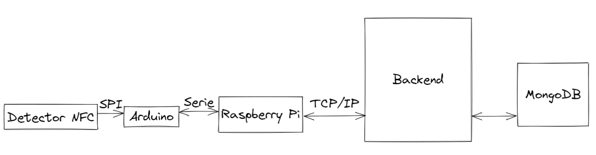
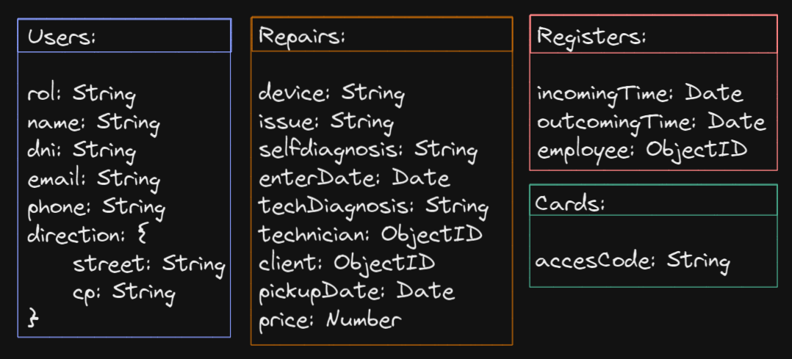

# P2-Reparaciones

# JVJ-REPAIRS

## INTRODUCCIÓN

Como segundo proyecto del bootcamp que estamos realizando, hemos elaborado una API para un taller de reparaciones de aparatos electrónicos.

## TECNOLOGÍA Y LENGUAJES

Para la realización de estos proyectos hemos empleado las siguientes tecnologias:

### JavaScript

### MongoDB

### PostMan

### Mongoose

### Express

### JsonWebToken

## FRONTEND

El FrontEnd sera desarrollado en la segunda fase del proyecto

## BACKEND

La API que hemos desarrollado se encuentra respladada por una base de datos la cual hemos subdividido en dos colecciones, siendo estas USUARIOS y REPARACIONES.
Para lograr el funcionamiento de esta API hemos tenido que desarrollar los modelos de ambas colecciones,
así como los controladores para ambas. Además, hemos implantado autentificaciones para filtrar el acceso
de los usuarios a los datos.

## SISTEMA DE COMUNICACIONES

## DIAGRAMA DE COLECCIONES NOSQL

## TABLA DE REQUEST

| P2 - REPARACIONES     |                |                  |                  | Comprobaciones de rol:               |                                        |
| --------------------- | -------------- | ---------------- | ---------------- | ------------------------------------ | -------------------------------------- |
| USERS:                | ROL: Client    | ROL: Employee    | ROL: Admin       | Middleware                           | Endpoints                              |
| getAllUsers           | 0              | 1                | 1                | auth + checkRol                      | GET: /api/users/                       |
| getInfoFromClientID   | \*             | 1                | 1                | auth + checkRolFirstAndIdBefore      | GET: /api/users/client/:idUser         |
| getInfoFromEmployeeID | 0              | \*               | 1                | auth + checkRolFirstAdminAndIdBefore | GET: /api/users/employee/:idUser       |
| getInfoFromAdminID    | 0              | 0                | 1                | auth + checkRolAdmin                 | GET: /api/users/admin/:idUser          |
| getHistoryRepair      | \*             | 1                | 1                | auth + checkRolFirstAndIdBefore      | GET: /api/users/:idUser/historyrepair  |
| addNewClient          | signup(Client) | signup(Client)   | signup(Client)   |                                      | POST: /api/users/client/               |
| addNewEmployee        | 0              | signup(Employee) | signup(Employee) |                                      | POST: /api/users/employee/             |
| addNewAdmin           | 0              | 0                | signup(Admin)    |                                      | POST: /api/users/admin/                |
| putClientInfo         | 1              | 1                | 1                | auth                                 | PUT: /api/users/client/:idUser         |
| putEmployeeInfo       | 0              | \*               | 1                | auth + checkRolFirstAdminAndIdBefore | PUT: /api/users/employee/:idUser       |
| putAdminInfo          | 0              | 0                | 1                | auth + checkRolAdmin                 | PUT: /api/users/admin/:idUser          |
| deleteClient          | \*             | 1                | 1                | auth + checkRolFirstAndIdBefore      | DELETE: /api/users/client/:idUser      |
| deleteEmployee        | 0              | 0                | 1                | auth + checkRolAdmin                 | DELETE: /api/users/employee/:idUser    |
| deleteAdmin           | 0              | 0                | 1                | auth + checkRolAdmin                 | DELETE: /api/users/admin/:idUser       |
| REPAIR:               |                |                  |                  |                                      |                                        |
| getAllRepairs         | 0              | 1                | 1                | auth + checkRol                      | GET: /api/repairs/                     |
| getRepairsByID        | \*             | \*               | 1                | auth + checkRolFirstAndIdBefore      | GET: /api/repairs/:idRepair            |
| getEnterDate          | 1              | 1                | 1                | auth + checkRolFirstAndIdBefore      | GET: /api/repairs/:idRepair/enterdate  |
| getPickupDate         | 1              | 1                | 1                | auth + checkRolFirstAndIdBefore      | GET: /api/repairs/:idRepair/pickupdate |
| getPrice              | 1              | 1                | 1                | auth + checkRolFirstAndIdBefore      | GET: /api/repairs/:idRepair/price      |
| addNewRepair\*\*\*    | 1              | 1                | 1                | auth                                 | POST: /api/repairs/                    |
| updateRepair\*\*\*    | 0              | 1                | 1                | auth + checkRol                      | PUT: /api/repairs/:idRepair            |
| putEnterDate          | 0              | 1                | 1                | auth + checkRol                      | PUT: /api/repairs/:idRepair/enterdate  |
| putPickupDate         | 0              | 1                | 1                | auth + checkRol                      | PUT: /api/repairs/:idRepair/pickupdate |
| putPrice              | 1              | 1                | 1                | auth + checkRol                      | PUT: /api/repairs/:idRepair/price      |
| deleteRepair          | 1              | 1                | 1                | auth                                 | DELETE: /api/repairs/:idRepair         |
| CARDS:                |                |                  |                  |                                      |                                        |
| getAllCards           | 0              | 0                | 1                | auth + checkRolAdmin                 | GET: /api/card/                        |
| getCardsById          | 0              | 0                | 1                | auth + checkRolAdmin                 | GET: /api/card/:idCard                 |
| addNewCard            | 0              | 0                | 1                | auth + checkRolAdmin                 | POST: /api/card/                       |
| updateCard            | 0              | 0                | 1                | auth + checkRolAdmin                 | PUT: /api/card/:idCard                 |
| deleteCard            | 0              | 0                | 1                | auth + checkRolAdmin                 | DELETE: /api/card/:idCard              |
| REGISTER:             |                |                  |                  |                                      |                                        |
| getAllRegisters       | 0              | 0                | 1                | auth + checkRolAdmin                 | GET: /api/register/                    |
| getRegisterById       | 0              | 0                | 1                | auth + checkRolAdmin                 | GET: /api/register/                    |
| addNewRegister        | 0              | 0                | 1                | auth + checkRolAdmin                 | POST: /api/register/                   |
| updateRegister        | 0              | 0                | 1                | auth + checkRolAdmin                 | PUT: /api/register/:idRegister         |
| deleteRegister        | 0              | 0                | 1                | auth + checkRolAdmin                 | DELETE: /api/register/:idRegister      |

## LINEAS FUTURAS

Para líneas futuras tenemos planeado implantar:

- FrontEnd
- Método de pago
- Calendario para que el usario pueda obtener una cita personalizada

## EQUIPO

- Vanesa María Rodríguez Pérez
- José Luis Pordomingo Brito
- Joseph Vento Pérez
